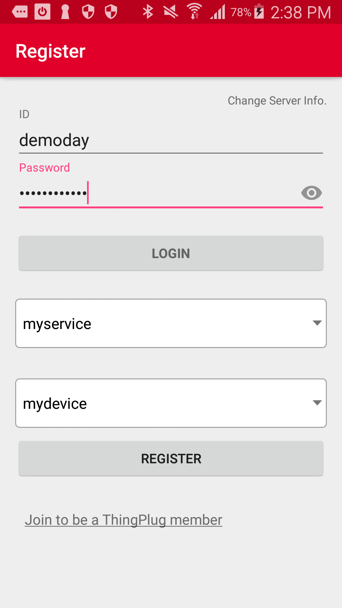

Device App & Service App Guide
===
SKT ThingPlug Android Simple SDK를 활용하여 개발되어진 Device App과 Service App에 대한 설명입니다.

## Overview

Sensor 목록
---
1. Battery : temperature(℃), charge level(％)
2. Temperature(℃)
3. Humidity(％)
4. Noise(㏈)
5. GPS : latitude(˚), longitude(˚), altitude(˚)
6. Air pressure(h㎩)
7. Brightness(㏓)
8. Proximity(㎝)
9. Accelerometer : X(㎨), Y(㎨), Z(㎨)
10. Orientation : azimuth(˚), pitch(˚), roll(˚)
11. Gravity : X(㎨), Y(㎨), Z(㎨)
12. Gyroscope : X(˚), Y(˚), Z(˚)
13. Magnetic field : X(µT), Y(µT), Z(µT)
14. Step detector(detection)
15. Step count(steps)

Actuator 목록
---
1. Buzzer : ringtone, notification, alarm
2. LED : off, red, green, blue, magenta, cyan, yellow, white
3. Camera : back, front

## Device Application
---
1. 동작 환경
	- Android OS 4.0.3(ICE_CREAM_SANDWICH_MR1, API Level 15) 이상
2. App. 권한 승인
	- Android OS 6.0(Marshmallow, API Level 23) 이상의 단말에서는 GPS 및 카메라 사용, Noise 센서 표시에 필요한 권한 허용 팝업이 표시됩니다. Android OS 6.0 미만의 단말에서는 App설치 시 권한을 확인하게 됩니다.
	    
3. 약관 동의
	 
	- AGREE를 선택할 경우, 위치정보 사용동의를 통해 해당 단말의 위치정보를 ThingPlug에 전송하게 됩니다.

4. 로컬 센서 목록
	 
	- 해당 단말에서 지원하는 센서 목록이 표시됩니다.
	- 센서 켜기(ENABLED)/끄기(DISABLED) 기능 : ThingPlug로 전송할 센서 정보를 선택할 수 있습니다. Device App에서 특정 센서를 끄면 Service App에서 원격으로 해당 센서의 활성화 및 비활성화 제어가 불가능하게 됩니다.
	- 센서 활성화(ACTIVATED)/비활성화(DEACTIVATED) 상태 표시 : Service App을 통해 원격에서 ThingPlug로 전송할 센서 정보를 선택할 수 있습니다. 원격에서 제어중인 특정 센서의 활성화 여부를 확인할 수 있습니다.
	- 특정 센서 선택 시 해당 센서의 상세 화면으로 이동합니다.
5. 센서 상세 화면
	 
    - 센서 상태값을 그래프로 표시합니다. 센서값에 따라 세로축이 가변으로 변하도록 설정되어 있습니다.
6. 환경 설정
	 
    - Sensor read interval(msec) : 센서에서 값을 읽어오는 간격
    - Transfer interval(msec) : 센서 정보를 ThingPlug 서버로 전송하는 간격
    - List update interval(msec) : 센서 목록 화면을 갱신하는 간격
    - Graph update interval(msec) : 센서 상세 화면의 그래프를 갱신하는 간격
	- Logout 버튼 : 로그인 정보를 삭제하고 로그인 화면으로 이동

## Service Application
---
1. 동작 환경
	- Android OS 4.0.3(ICE_CREAM_SANDWICH_MR1, API Level 15) 이상
2. 디바이스 선택
	 
	- 로그인을하면, ThingPlug 포털에 등록된 서비스와 디바이스 목록을 표시합니다. 서비스 선택 후, 한번에 한개의 디바이스를 모니터링 할 수 있으므로 모니터링하고자 하는 디바이스를 선택합니다.
3. 원격 센서 목록
	 
	- 전체 센서 목록이 나열되며, Device App에서 미지원하거나 꺼진(DISABLED) 센서의 경우 비활성화된 상태로 표시됩니다.
	- 센서 활성화(ACTIVATED)/비활성화(DEACTIVATED) 기능 : Device App의 센서 활성화 상태를 원격에서 변경합니다.
	- 특정 센서 선택 시 해당 센서 상세 화면으로 이동합니다.
5. 센서 상세 화면
	 
    - 센서 상태값을 그래프로 표시합니다. 센서값에 따라 세로축이 가변으로 변하도록 설정되어 있습니다.
6. 환경 설정
	 
    - Transfer interval(msec) : Device 앱의 센서 주기보고 간격, 제어를 통해 전달한다.
    - Graph update interval(msec) : 센서 상세 화면의 그래프를 갱신하는 간격
    - Show content : 선택시 Device 앱으로부터 전달된 content raw data 를 보여준다.
	- Logout 버튼 : 로그인 정보를 삭제하고 로그인 화면으로 이동

Copyright (c) 2017 SK Telecom Co., Ltd. All Rights Reserved.
